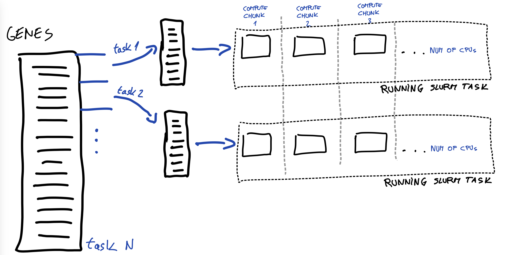
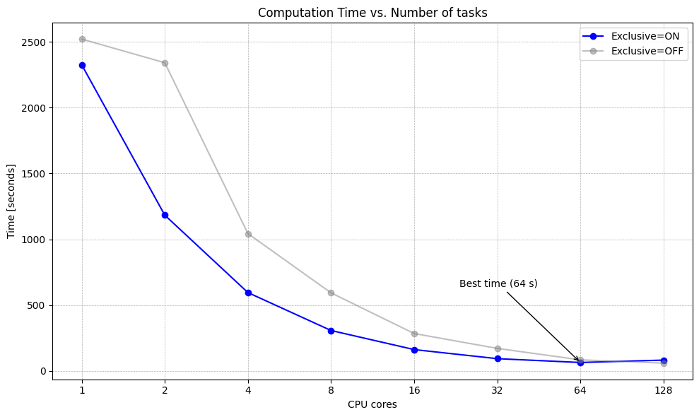
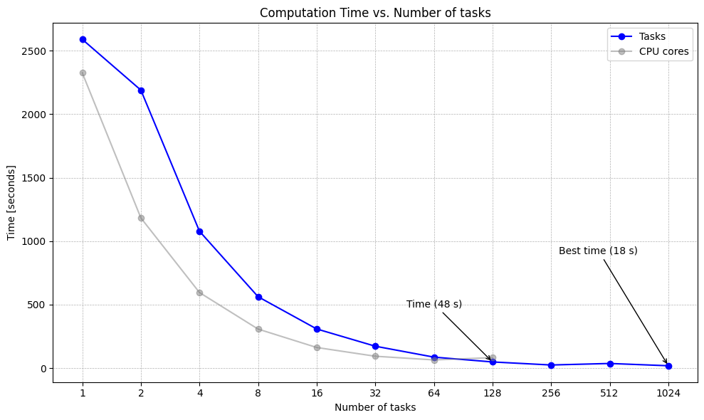

# Problem

Understanding the interactions between genes is pivotal in unraveling the complexities of biology. Working with high-dimensional datasets, particularly those comprising roughly 20,000 known genes, presents a computational challenge. For example, we need to check 199,980,000 combinations when investigating all pairwise interactions. This complexity is further amplified as multiple experiments are often conducted with different permutations of data to assess the significance of the findings empirically.

Luckily, these experiments are easily parallelizable, as each basic computation step (e.g., calculation of pairwise interaction scores) is independent of the others. However, the high dimensionality of genomic data renders local machine calculations impractical. Implementing a programmatic approach that enables parallelization across multiple compute cores and distributes computations across nodes on compute clusters running SLURM can overcome this challenge.

This exercise aims to uncover gene interactions based on survival data, utilizing gene expression information and corresponding survival times from patients across the TCGA cohort for multiple cancer types.

# Data

This exercise focuses on 33 TCGA experiments, specifically TCGA-HNSC (head and neck squamous cell carcinoma). The data is further refined by selecting well-known [L1000](https://www.ncbi.nlm.nih.gov/pmc/articles/PMC5990023/) landmark genes, reducing noise through normalizing and standardizing gene expression values and discarding genes with low expression levels. We perform all these preprocessing steps before leveraging the compute cluster.

For slected TCGA experiment (HNSC) the final processed data consists of two files:

1. **TCGA-HNSC-data.csv**: After preprocessing, this dataset includes 519 samples and 857 genes + survival data.
2. **TCGA-HNSC-combinations.csv**: This file contains 365,085 unique gene pairs, where each row represents a unique combination.

These numbers differ across the various TCGA datasets, reflecting each dataset's specific characteristics and requirements.

# Methods

### Experimental setup:

- We used **ARNES** compute cluster to run our experiments. 
 
- We limited ourselves to compute nodes with ids ranging from wn101 to wn162. These are nodes with 128 compute cores with AMD procesors.

- Try different SLURM job configurations; multiple tasks accorss different nodes, multiple tasks on the same node, multiple CPU cores per task, etc.

### Python script:

We implemented a python script which has two inputs; **data** and all **pair-wise combinations of genes**. Example of running the [script](compute.py):

``` bash
compute.py --tcga_project "project-name" --input_data "path_to_data" --input_genes "path_to_gene_combinations"
```

Our [script](compute.py) is designed to work seamlessly with SLURM workload manager, allowing it to partition the input data across the specified number of SLURM tasks and fully utilize all available CPU cores within each task.

The [script](compute.py) achieves this adaptability by reading SLURM environment variables like `SLURM_PROCID`, `SLURM_CPUS_PER_TASK`, and `SLURM_NTASKS`, which inform it about the task ID, the number of CPUs available per task, and the total number of tasks, respectively.

Part of the [script](compute.py) that is responsible for spliting the input genes based on the number of tasks:

``` python
num_of_tasks = int(os.environ.get('SLURM_NTASKS'))
slurm_proc_id = int(os.environ.get('SLURM_PROCID'))

genes = pd.read_csv(args.input_genes, header=None)

if num_of_tasks == 1:
    genes = genes.values
else:
    # split input array in equal chunks based on `num_of_tasks`
    # and select the corresponding chunk based on `slurm_proc_id`
    # which is is ranging from 0 to `num_of_tasks` - 1
    genes = np.array_split(genes, num_of_tasks)[slurm_proc_id].values
```

After obtaining the necessary chunk of input genes, we employ the [Joblib](https://joblib.readthedocs.io/en/stable/parallel.html) to further distribute the genes across the available CPU cores for a given task. Joblib is a Python library that provides an easy-to-use API for parallelizing computation across multiple cores. Joblib can support both multi-threading and multi-processing. The choice between spawning a thread or a process is determined by the backend that joblib is utilizing.

Part of the [script](compute.py) that is responsible for further distributing the computation across the available CPU cores in a given task:

``` python
cpus_per_task = int(os.environ.get('SLURM_CPUS_PER_TASK'))

df = pd.read_csv(input_data)

if cpus_per_task == 1:
    parallel_kwargs = {'return_as': 'generator'}
else:
    parallel_kwargs = {'n_jobs': cpus_per_task, 
                       'return_as': 'generator', 
                       'batch_size': len(genes)//cpus_per_task, 
                       'pre_dispatch': 'all'}

# If we use n_jobs = -1, joblib will use all available CPU cores.
# However, python process will see all available CPU cores on the node.
# This number may be different from what we specified in our SLURM job config.
# To avoid this, we use `cpus_per_task` to specify the number of CPU cores.

# run the parallel computation
parallel = Parallel(**parallel_kwargs)
results = parallel(
    delayed(worker)(g1, df[g1], g2, df[g2], df['time'], df['event'])
    for g1, g2 in genes
)
```


The image below illustrates the overall workflow of the [script](compute.py) and how it interacts with the SLURM scheduler.



In summary we split input genes in two distinct ways; given a number of tasks and CPU cores in a give task. This allows us to easily scale the computation based on the available resources. With this approach we were able to experiment with different SLURM job configurations and compare the results. 


### SBATCH configuration:

Finaly here is the template of SBATCH bash script we used to run our experiments. In this script we (1) provide the required resources and other parameters for the execution of the job, (2) we load Anaconda environment through modules, (3) we specify the path to the Python interpreter of the conda environment, and (4) we use 'srun' to run the python script.

```bash
#!/bin/bash
#SBATCH --time=00:01:00
#SBATCH --job-name=gene_interactions
#SBATCH --output=stdout/%x-%A_%a.out
#SBATCH --error=stderr/%x-%A_%a.err
#SBATCH --ntasks=<number_of_tasks>
#SBATCH --cpus-per-task=<number_of_cpus>
#SBATCH --nodes=<desired_number_of_nodes>
#SBATCH --array=<range_of_permutations>
#SBATCH --exclude=wn[051,052,053,061,062,064,065]

# Load module
module load Anaconda3/2022.05

# Specify the path to the Python interpreter of the conda environment
PYTHON_ENV_PATH="/d/hpc/home/jkokosar/miniconda3/envs/dev/bin/python"

tcga_project=$1

data_input_file="data/${tcga_project}/${tcga_project}-data.csv"
gene_input_file="data/${tcga_project}/all-combinations.csv"


# Run the script with the Python interpreter of the environment
srun $PYTHON_ENV_PATH compute.py --tcga_project "$tcga_project" --input_data "$data_input_file"  --input_genes "$gene_input_file"
```


# Benchmark Setup

Ultimately, we would like to use this environment to speed up our experiments. Here, we are focusing on a specific dataset and a reduced number of genes. On our local machine, M1 Macs, there are 8 high-performance cores. If we use all the compute power on this specific dataset, we roughly need around 3 minutes. However, we have to consider the following:

- There are 33 different TCGA datasets (different cancer types).
- At some point, we would like to work with larger sets of genes.
- We want to perform permutation tests, which add additional computational needs.

Just to run one experiment of this size and 1000 permutation tests, it would take us more than 48 hours. Access to such computer systems can significantly contribute to the accelerated execution of these kinds of experiments. Below, we present several different scenarios and benchmarks that have helped us in understanding and managing these kinds of systems.

## sacct vs time library
We decided to use `sacct` to extract the runtimes of the python script. What we found is that those times differ significantly from time measured in python script. We suspect this is because `sacct` times probably also consider the time it takes for the resources to be allocated. For example, when we ran a `sbatch` with 1024 tasks and 1 CPU core and printed compute times for all tasks (using the time library in python), we got ranging values from 4 to 5s (per task). If we do `sacct` of that job, the raw elapsed time is around 14s. This was just one example, but we consistently noticed the difference in our experiments.

## slower nodes
We also noticed that the same jobs would have slower runtimes on smaller nodes. In our experiments, we decided to always use the following flag:
```#SBATCH --exclude=wn[051,052,053,061,062,064,065]```

## baseline
To set a baseline for our experiment we measured 3 separate runs on 1, 2, 4, 16, 32, 64 and 128 cores (as this is the maximum CPU logical cores in compute node).

The final config was the following:

``` bash
#SBATCH --ntasks=1
#SBATCH --cpus-per-task=<number_of_cpus>
#SBATCH --array=1-3
#SBATCH --exclude=wn[051,052,053,061,062,064,065]
#SBATCH --nodes=1
#SBATCH --exclusive
```

Note that we use the `--exclusive` option to reserve a full node for the duration of our computation. The reason for this is that we have observed varying compute times across different jobs with the same configuration. This likely indicates that different processes were sharing resources on a node. We reserved the entire node exclusively for this baseline runs, even though it made queueing more challenging, with wait times extending to days or even weeks at times. When using  `--exclusive` we observed much more consistent results.



We observe that adding additional cores for the given number of inputs yields diminishing returns after certain point. We suspect that given a larger input size this would not be the case.


We also wanted to compare this results if we only used different number of tasks (average of 5 runs) and one CPU per task:
``` bash
#SBATCH --ntasks=<num_of_tasks>
#SBATCH --cpus-per-task=1
#SBATCH --array=1-5
#SBATCH --exclude=wn[051,052,053,061,062,064,065]
```



We can observe that there is additional overhead when using tasks versus only CPU cores. But after around 128 tasks this starts paying off.

We noticed that at some point, the overhead of scheduling tasks overshadows the speedups gained from reducing input sizes. This becomes evident when we measure the time within the Python script and compare it to what sacct reports, a discrepancy that is clearly visible. To illustrate this, take a look at the zoomed-in version of the graph above:


If we measure the time within the Python script and compare it to what sacct reports, this discrepancy is indeed clearly visible.


## 1000 permutations
We used array jobs to perform experiments with 1,000 permutations. We used the following configuration:

``` bash
#!/bin/bash
#SBATCH --time=00:00:30
#SBATCH --job-name=perm_<num_tasks>-<num_cores>
#SBATCH --output=stdout/%x-%A_%a.out
#SBATCH --error=stderr/%x-%A_%a.err
#SBATCH --ntasks=<num_tasks>
#SBATCH --cpus-per-task=<num_cores>
#SBATCH --ntasks-per-node=<depends_on_config>
#SBATCH --nodes=<depends_on_config>
#SBATCH --array=1-1000
#SBATCH --exclude=wn[051,052,053,061,062,064,065]
```

We use the `SLURM_ARRAY_TASK_ID` environment variable to keep track of permutation tests. That is, when the array task ID is 1, we operate on the original data, and all subsequent IDs represent permutation tests.

We tried several different configurations:
- 1024 tasks, 1 CPU core

    **Job submition time:** 17:12:45 <br>
    **ob end time:** 10:12:32 <br>
    **Duration of a job:** 16:59:47 <br>
    **Avg. runtime of python scripts:** 15.583 seconds<br>

- 16 tasks, 64 CPU cores (2 tasks per node):

    **Job submition time:** 22:33:27 <br>
    **Job end time:** 07:00:44 <br>
    **Duration of a job:** 08:27:17 <br>
    **Avg. runtime of python scripts:** 18.343 seconds

- 32 tasks, 32 CPU cores (4 task per node)

    **Job submition time:** 07:00:44  <br>
    **Job end time:** 23:35:00  <br>
    **Duration of a job:** 16:34:16  <br>
    **Avg. runtime of python script:** 18.348 seconds


We significantly reduced the amount of time required to conduct numerous experiments. Instead of days, we now measure the time in hours. However, these durations appear to vary considerably, depending on how the SLURM scheduler handles our tasks.